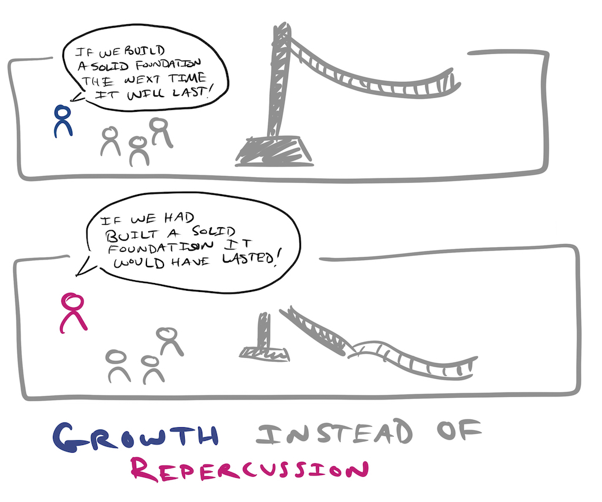
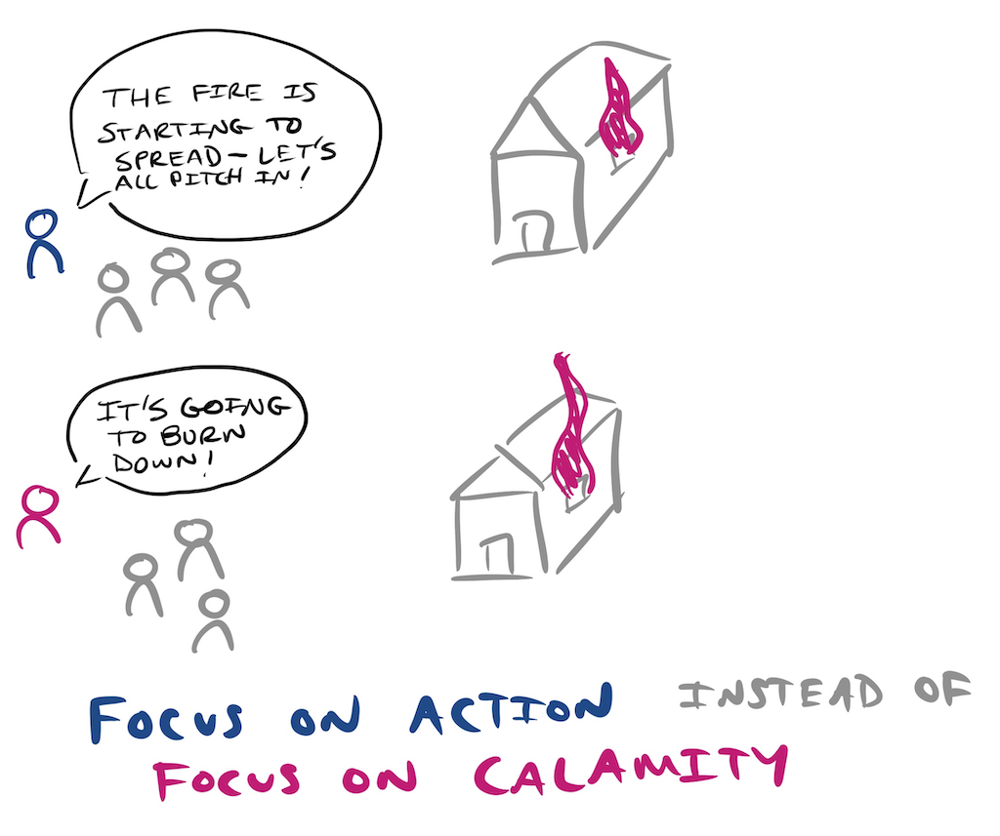
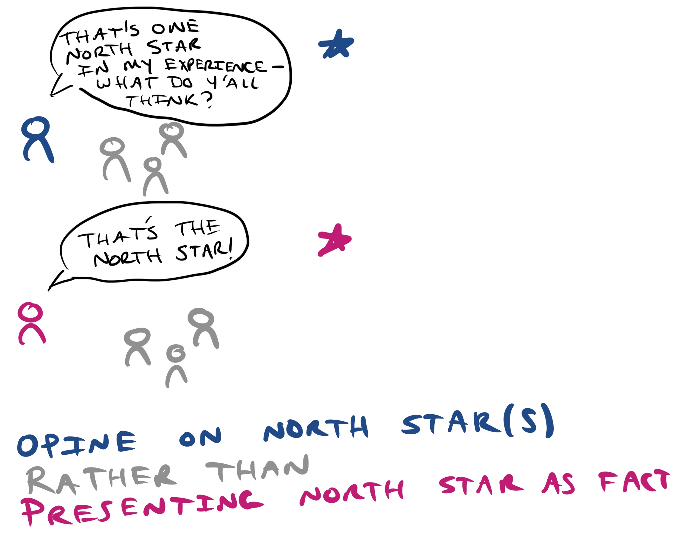

## Values and Personality

* I aspire to be **self-reflexive**, to have and model **humility**.
* I place a high value on **self-accountability** and **follow-through**.
* Facilitating the **growth** of other technologists is very important to me.

*Please provide [feedback](#receiving-feedback--recognition) if and when you feel I could do better in holding these values.*

## Me Being Me

* I'm very **confident**, often to a fault. *Sometimes I sound more confident than I am or feel. Feel free to probe if you perceive me as being overly confident—I'm working on this.*
* I can be quite **frank**, especially when I'm lost in the idea being discussed.
* I come from a very large, vocal family—I can sometimes worry about feeling **heard**.
* I've been known to be **verbose**, e.g. this document, and can sometimes get caught up in the **details**.

### Personality typologies

* My Myers–Briggs type is [INTJ](https://en.wikipedia.org/wiki/INTJ).
* My Insights Discovery Position is [22: Reforming Director (Classic)](./InsightsProfile.pdf)

## Receiving Feedback & Recognition

**Airbnb colleagues**: Reflektive is a great place for appreciation/recognition. You can also submit feedback (compliments, suggestions, criticisms, and advice) to my manager at [air/feedback-for-adam-bloomston](https://air/feedback-for-adam-bloomston).

* I prefer when others **ask permission** before giving feedback. This helps me to prepare for potential criticism, and gives me the choice to defer it if I'm not in a good place to receive it.
* I prefer to receive criticism **in private** and with **concrete examples** of where I could have done better—these help anchor me in the facts, rather than my emotions. *I appreciate and value this feedback, and can’t get enough of it.*
* I **appreciate recognition** for my positive impact.

## Areas for Development

### High-level areas for development

* Facilitating technical growth, working with colleagues in and outside [Airbnb](https://airbnb.io/)
  * I'm a 2019 [First Round Fast Track Mentor](https://fasttrack.firstround.com/).
  * Departing from the standard mentor-mentee dynamic, I prefer a collaborative relationship where both of us teach, learn, challenge, and are challenged.
* Leadership
  * I attended a [Co-Active Leadership Experience](http://www.coactive.com/leadership/experience) Workshop in 2018
  * I am currently participating in a 10 month long [Co-Active Leadership Program](http://www.coactive.com/leadership/program)
* Facilitation
  * I attended a [Group Facilitation Skills](http://www.communityatwork.com/groupfac1.html) Workshop in 2018
  * I will be attending a [Graphic Facilitation Workshop](https://www.grove.com/workshops_principlesGraphicFacilitation.php) in Q1 2019.
* Systems Thinking, Software Development, and Organizations: everything written by [Gerald Weinberg](https://en.wikipedia.org/wiki/Gerald_Weinberg) 🤓

### Concrete areas for development

Based on feedback from my colleagues at [Airbnb](https://airbnb.io/):

*[Feedback](#receiving-feedback--recognition) is always appreciated, especially in the areas above.*

## Work Patterns

* I work as an engineer on the Anti-discrimination team at [Airbnb](https://airbnb.io/).
* In the mornings (9am-12pm) I tend to focus on solo (🎧) work.
* **I prefer meetings, including 1:1s, after lunch (1pm-5pm)**.
* I follow and work from home on [No Meeting Wednesdays](https://wavelength.asana.com/workstyle-no-meeting-wednesdays/#close).
* I keep my [Slack status](https://get.slack.help/hc/en-us/articles/201864558-Set-your-Slack-status-and-availability) and calendar very up to date.
* I bring my dog, Baby Doctor, to work with me every day. If he's bothering you at all, please let me know—no offense will be taken, I promise!

## Communication Preferences

* I aim to **respond to emails the same business day**.
* I aim to **respond in Slack within an hour**.
* I take **distraction** seriously and am very sensitive to **work-life-balance;** for example phones are left by the door, on vibrate (exception is if I'm on-call), in my home.

## How To Know I’ve Gone To The Dark Side

### Warning Signs

* I'm quick to judge or make large generalizations such as "I hate postgres."
* I focus on minor points of logical error, losing the forest for the trees in a discussion.
* I mention that I'm "hangry" (hungry + angry)—this means I haven't eaten in a few hours.

### How to help

* Ask me if it would be helpful to table the conversation until later.
* Ask me what my goal is in the conversation.
* Offer me food, such as a 🍌

## Pet Peeves

*I don't expect this list to change your actions—but it might help you better understand and empathize with my reactions.*

* Tardiness—*I'm a New Yorker, after all.*
* Meetings without a clear agenda or an explicit facilitator.
* A (perceived) lack of follow-through.

## Ask Me About

1. Why I love to travel ([hint](http://mrconsole-eats.tumblr.com/)).
2. My uninformed obsession with birds.
3. My dog, Baby Doctor.
